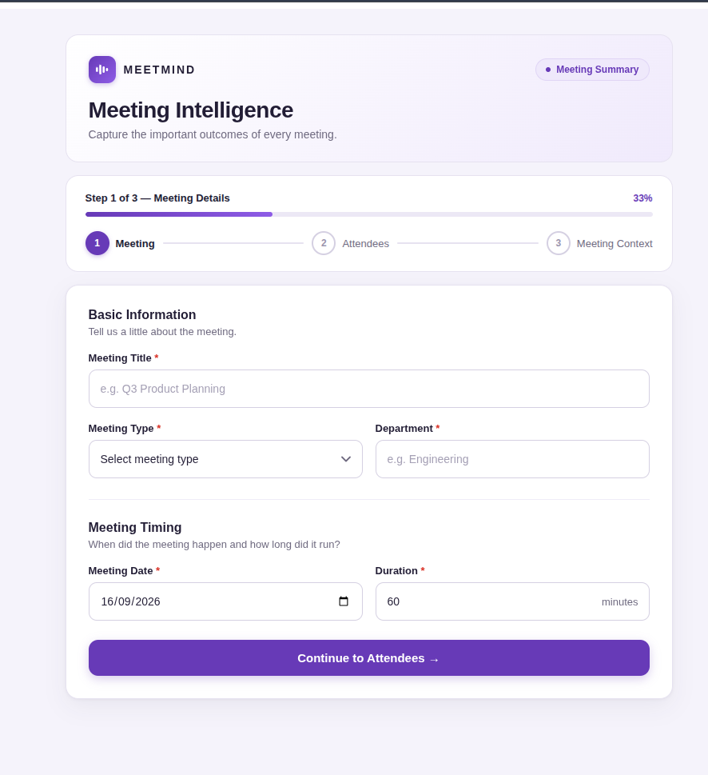

# MeetMind

Frappe application that transforms raw meeting data into measurable business intelligence.



## Project Overview

MeetMind is a meeting intelligence platform designed to capture meeting information and convert it into actionable business insights.

The application focuses on:

* Meeting effectiveness
* Decision tracking
* Action-item tracking
* Participant accountability
* Ghost action-item detection
* Zombie decision detection
* Meeting health analysis
* Business intelligence and analytics

## Current Scope

The initial version contains seven core DocTypes.

| DocType                  | Purpose                            | Type             |
| ------------------------ | ---------------------------------- | ---------------- |
| **Meeting Session**      | Main meeting record                | Main Transaction |
| **Meeting Attendee**     | Meeting participants               | Child Table      |
| **Decision Log**         | Decisions made during meetings     | Submittable      |
| **Action Item**          | Tasks assigned during meetings     | Submittable      |
| **Meeting Config**       | Global application configuration   | Single           |
| **Meeting Participant**  | Master record of meeting people    | Master           |
| **Employee Ghost Score** | Participant action-item metrics    | System Generated |

## Core DocTypes

### 1. Meeting Session

Main transactional document representing a meeting.

It stores:

* Meeting title and date
* Start time and duration
* Department
* Meeting type
* Attendees
* Agenda
* Agenda adherence
* Meeting cost
* Meeting health score
* Monologue detection
* Decision count
* Open action-item count
* Meeting status
* Notes

Naming series:

`MEET-.YYYY.-.#####`

### 2. Meeting Attendee

Child table attached to Meeting Session.

It stores participant-level information such as:

* Participant
* Participant name
* Designation
* Talk percentage
* Annual CTC
* Hourly rate
* Attendance

The attendee data will later be used for meeting-cost and meeting-behaviour calculations.

### 3. Decision Log

Submittable document used to track decisions made during meetings.

It stores:

* Meeting
* Decision title and details
* Decision owner
* Confidence level
* Decision status
* Target date
* Revisit count
* Zombie status
* Zombie date
* Previous decision
* Resolution notes

Naming series:

`DEC-.YYYY.-.#####`

### 4. Action Item

Submittable document used to track tasks generated from meetings.

It stores:

* Meeting
* Task title and description
* Assignee
* Assigner
* Due date
* Priority
* Status
* Completion percentage
* Completion date
* Days overdue
* Ghost status
* Reminder status

Naming series:

`ACT-.YYYY.-.#####`

### 5. Meeting Config

Single DocType containing global MeetMind configuration.

It controls:

* Ghost threshold
* Zombie decision threshold
* Monologue threshold
* Application currency
* Manager email
* HR email
* Email alert configuration
* Working hours per day
* Working days per month

This is a **Single DocType** and does not use naming series or document submission.

### 6. Employee Ghost Score

System-generated document containing participant-level action-item performance metrics.

It tracks:

* Total assigned actions
* Total completed actions
* Total overdue actions
* Total ghost actions
* Ghost score percentage
* Completion rate percentage
* Last updated time
* Risk level

This document will be maintained by application logic and scheduled processing.

### 7. Meeting Participant

Master record of people who attend meetings.

It stores:

* Participant name and type
* Email and phone
* Designation, department, and company
* Annual CTC
* Active status
* Default talk percentage
* Aggregated meeting statistics

Naming series:

`PART-.YYYY.-.#####`

## External DocType Dependencies

MeetMind references existing Frappe/other application DocTypes:

* Department
* Currency

These DocTypes are **referenced only** and are not created or modified by MeetMind.

MeetMind does not require ERPNext or Frappe HR for its core application architecture.

## Business Logic

The planned intelligence layer will calculate:

### Meeting Cost

Meeting cost will be calculated using attendee hourly rates and meeting duration.

### Meeting Health Score

The meeting health score will consider factors such as:

* Agenda adherence
* Participation balance
* Meeting duration
* Decision activity
* Open action items

### Monologue Detection

The system will identify meetings where one attendee dominates the conversation based on the configured talk-percentage threshold.

### Zombie Decision Detection

Decisions that are repeatedly revisited without effective resolution will be identified as zombie decisions.

### Ghost Action Detection

Action items that remain incomplete beyond the configured threshold will be identified as ghost actions.

### Employee Ghost Score

Participant-level ghost-action metrics will be aggregated to identify completion performance and risk levels.

## Development Status

### Completed

* Frappe application setup
* Meeting Intelligence module
* Core application architecture
* Meeting Session DocType
* Meeting Attendee child table
* Decision Log DocType
* Action Item DocType
* Meeting Config Single DocType
* Meeting Participant DocType
* Employee Ghost Score DocType
* Required field definitions
* External DocType links
* Naming series configuration
* Submittable document configuration

### Planned

* Server-side business logic
* Meeting cost calculation
* Meeting health scoring
* Monologue detection
* Zombie decision detection
* Ghost action detection
* Participant ghost-score calculation
* Scheduled processing
* Email notifications
* Reports
* Dashboards

## Technology

* Frappe Framework 16
* Python
* JavaScript
* MariaDB
* Frappe DocType architecture

## Project Structure

```text
meeting_intelligence/
├── meeting_intelligence/
│   ├── doctype/
│   │   ├── meeting_session/
│   │   ├── meeting_attendee/
│   │   ├── decision_log/
│   │   ├── action_item/
│   │   ├── meeting_config/
│   │   ├── meeting_participant/
│   │   └── employee_ghost_score/
│   └── module_def/
│
├── hooks.py
├── modules.txt
├── pyproject.toml
├── README.md
└── license.txt
```

## Roadmap

```text
Meeting Data
     ↓
Meeting Analysis
     ↓
Decision Tracking
     ↓
Action Tracking
     ↓
Ghost / Zombie Detection
     ↓
Participant & Meeting Metrics
     ↓
Reports & Dashboards
     
```

## License

MIT